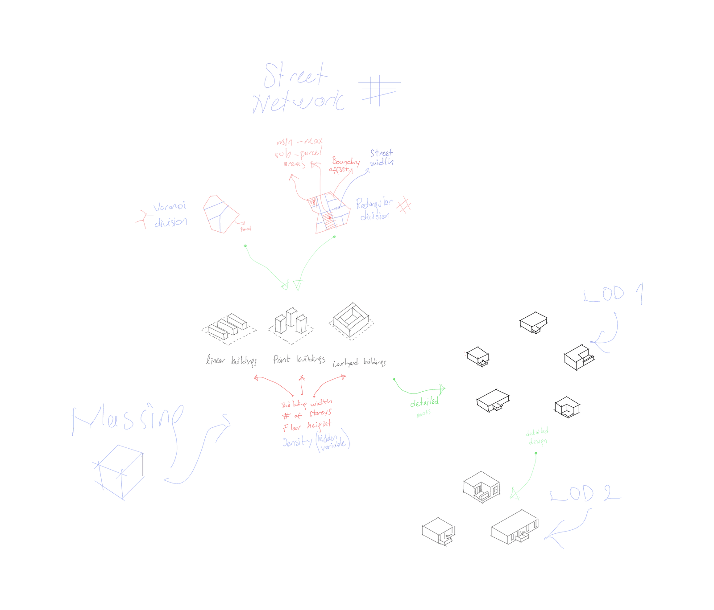
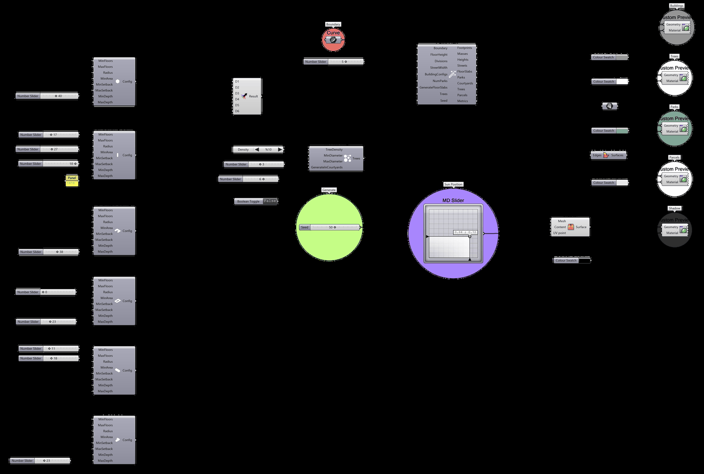

# Gallery

Massing alternatives generated by Mycelium from a single parcel boundary. Each one is the
output of one seed — change the seed, get a different city with the same rules.

{.skip-lightbox}

---

## Generated Alternatives

<figure markdown="span">
  { loading=lazy }
  <figcaption>Irregular grid, mixed typologies</figcaption>
</figure>

<figure markdown="span">
  { loading=lazy }
  <figcaption>Perimeter blocks with courtyards</figcaption>
</figure>

<figure markdown="span">
  { loading=lazy }
  <figcaption>Parks and street trees allocated across blocks</figcaption>
</figure>

<figure markdown="span">
  { loading=lazy }
  <figcaption>Point blocks and towers</figcaption>
</figure>

<figure markdown="span">
  { loading=lazy }
  <figcaption>Linear bars along the block long axis</figcaption>
</figure>

<figure markdown="span">
  { loading=lazy }
  <figcaption>Massing over procedural terrain</figcaption>
</figure>

---

## Generation Scheme

<figure markdown="span">
  { width="600" loading=lazy }
  <figcaption>Recursive binary space partitioning splits the parcel into blocks separated by streets</figcaption>
</figure>

<figure markdown="span">
  { width="600" loading=lazy }
  <figcaption>Each block receives a building typology drawn from the configurations you allow</figcaption>
</figure>

<figure markdown="span">
  { loading=lazy }
  <figcaption>End-to-end algorithm: boundary in, massing and metrics out</figcaption>
</figure>

---

!!! tip "Built something with Mycelium?"

    Open an issue on
    [MyceliumGH-Dev/Mycelium](https://github.com/MyceliumGH-Dev/Mycelium/issues) with your
    images and we will consider adding them here.
