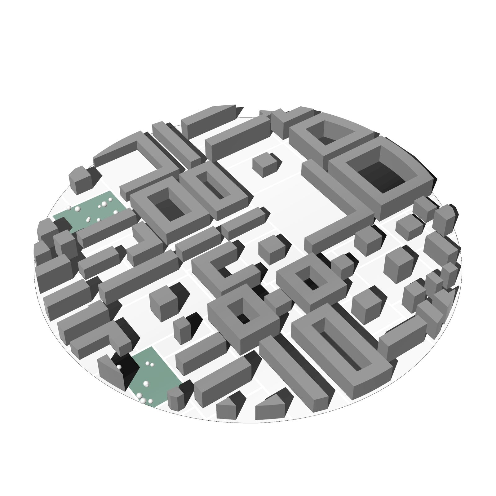
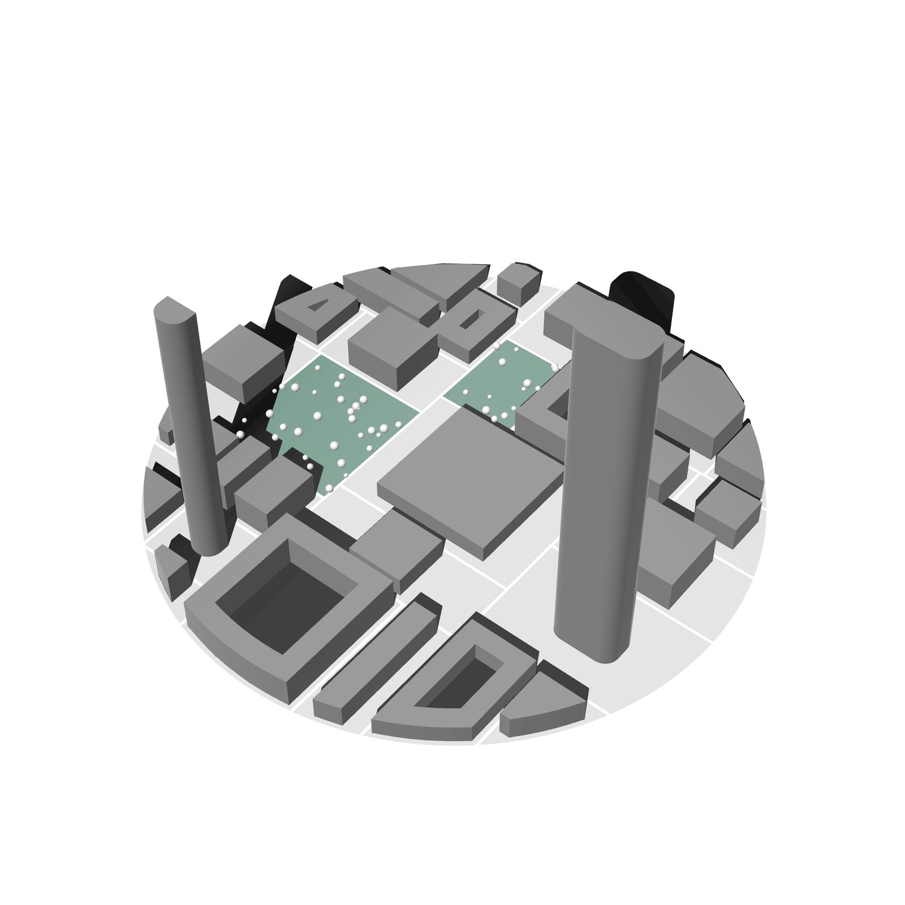
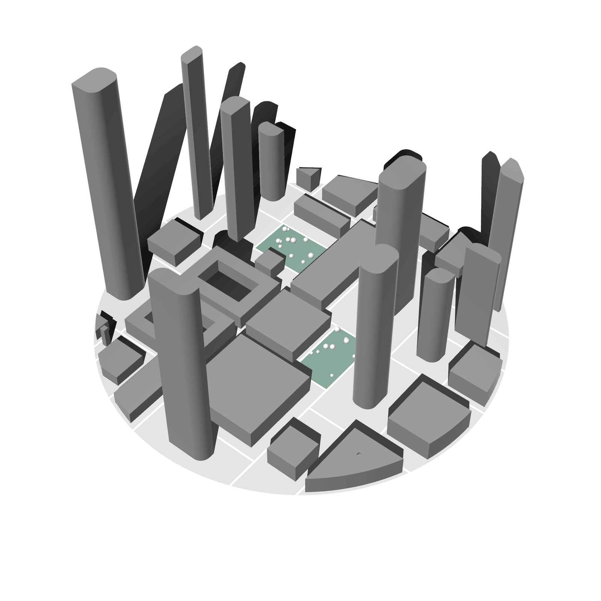
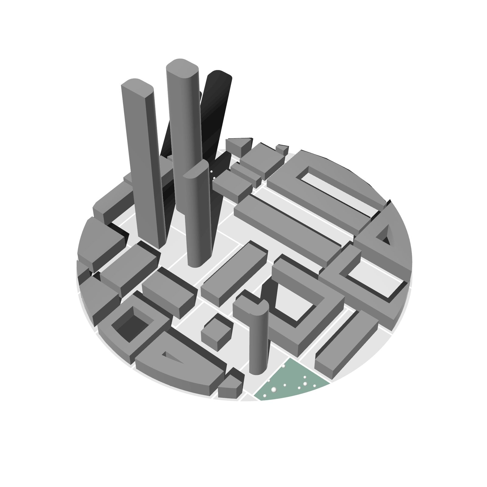
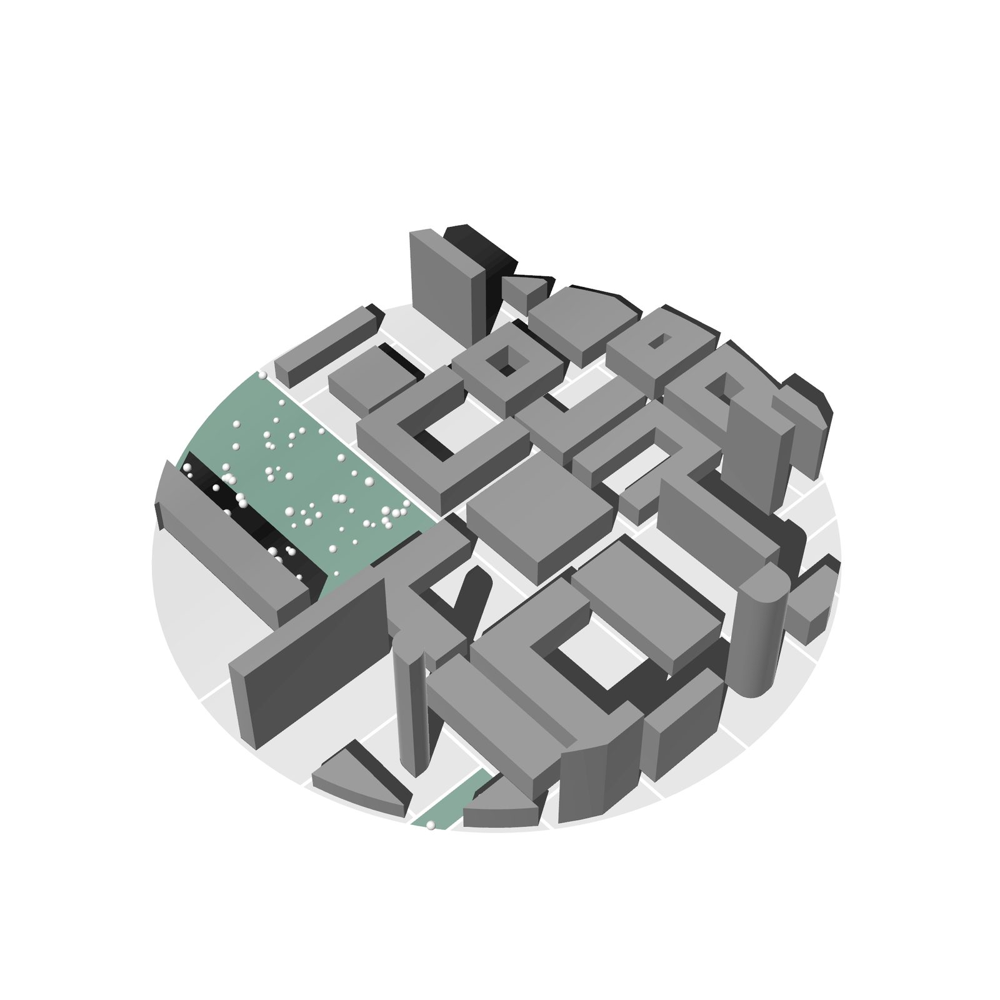
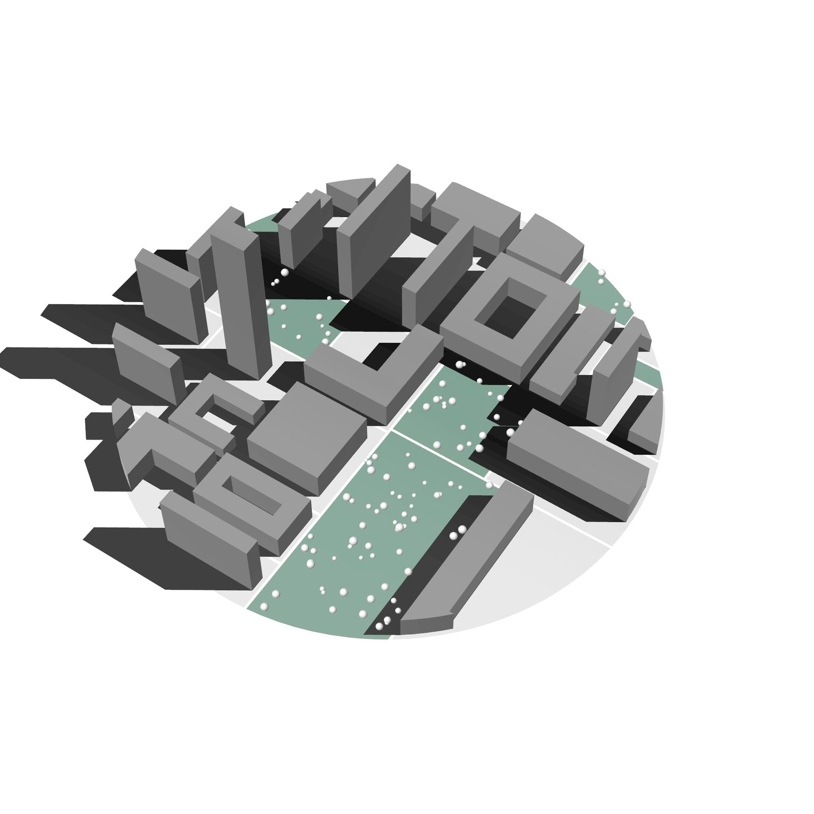

# Gallery

Massing alternatives generated by Mycelium from a single parcel boundary. Each one is the
output of one seed — change the seed, get a different city with the same rules.

{.skip-lightbox}

---

## Generated Alternatives

<figure markdown="span">
  { loading=lazy }
  <figcaption>Irregular grid, mixed typologies</figcaption>
</figure>

<figure markdown="span">
  { loading=lazy }
  <figcaption>Perimeter blocks with courtyards</figcaption>
</figure>

<figure markdown="span">
  { loading=lazy }
  <figcaption>Parks and street trees allocated across blocks</figcaption>
</figure>

<figure markdown="span">
  { loading=lazy }
  <figcaption>Point blocks and towers</figcaption>
</figure>

<figure markdown="span">
  { loading=lazy }
  <figcaption>Linear bars along the block long axis</figcaption>
</figure>

<figure markdown="span">
  { loading=lazy }
  <figcaption>Massing over procedural terrain</figcaption>
</figure>

---

!!! info "How it works"

    The generation algorithm — subdivision, typologies, open space, metrics — is covered in
    the [documentation](https://mycelium-gh-docs.netlify.app).

---

!!! tip "Built something with Mycelium?"

    Open an issue on
    [MyceliumGH-Dev/Mycelium](https://github.com/MyceliumGH-Dev/Mycelium/issues) with your
    images and we will consider adding them here.
