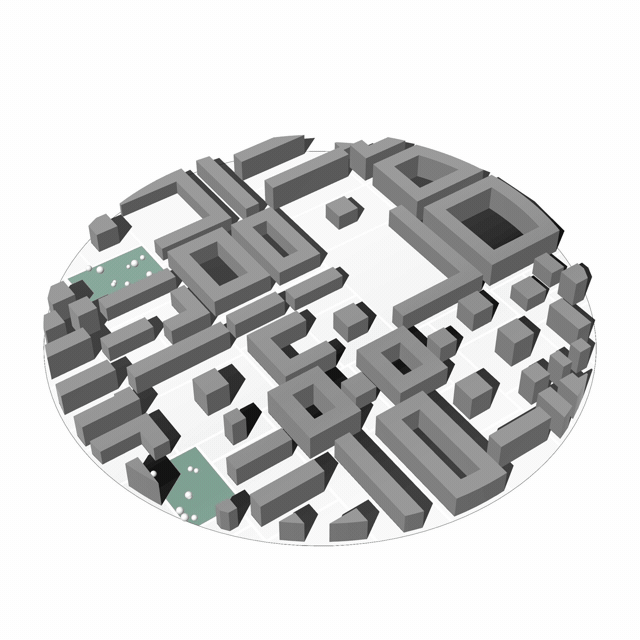
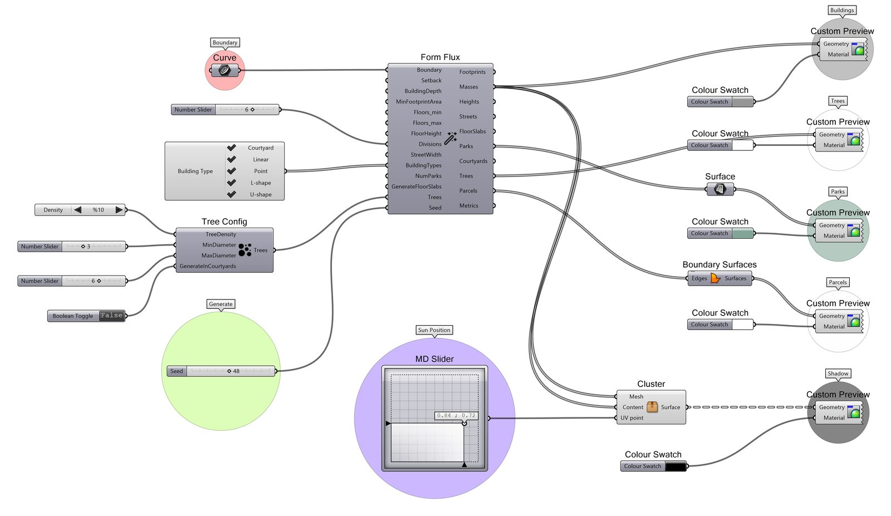

---
hide:
  - navigation
  - toc
---

# Mycelium {.sr-only}

<figure class="hero-logo" markdown="span">
  { width="180" .skip-lightbox .hero-logo__image }
</figure>

  Generative urban massing for Rhino&nbsp;8 and Grasshopper

{ .skip-lightbox .center }

  [Get Started :material-arrow-right:](https://mycelium-gh-docs.netlify.app){ .md-button .md-button--primary aria-label="Get started with the Mycelium documentation" }
  [Download :material-download:](download.md){ .md-button aria-label="Download Mycelium" }

  Free and open source under
  <a href="https://github.com/MyceliumGH-Dev/Mycelium/blob/dev/LICENSE" aria-label="Read the Apache 2.0 license">Apache&nbsp;2.0</a>.
  Installs through the Rhino Package Manager.

---

## :seedling:{ aria-hidden="true" } What It Does

Mycelium takes a **closed parcel boundary curve** and generates complete urban massing
alternatives. Every output is driven by a random seed, so alternatives are fully
reproducible — the same seed and the same parameters always give you the same city.

-   __:material-grid: Subdivision__

    ---

    Recursive binary space partitioning splits the parcel into building blocks separated
    by streets. Choose between irregular, orthogonal, diagonal, and radial–concentric
    street-network families — each with several sub-options.

-   __:material-office-building: Typologies__

    ---

    Each block receives a randomly selected building type from the configurations you
    allow: courtyard (perimeter block), linear bar, point block, L-shape, U-shape, or
    tall tower.

-   __:material-tree: Open Space__

    ---

    A chosen number of blocks become parks, populated with procedural trees. Courtyards
    can receive trees too, and terrain is generated from OpenSimplex noise.

-   __:material-chart-box: Metrics &amp; Provenance__

    ---

    Development metrics, environmental morphology indicators (`lambda_p`, `lambda_f`,
    height statistics), and a versioned JSON case manifest with a deterministic SHA-256
    case ID for every alternative.

---

## :gear:{ aria-hidden="true" } How It Works

{ loading=lazy }

---

## :rocket:{ aria-hidden="true" } Quick Start

1. Install Mycelium through the Rhino&nbsp;8 Package Manager (`_PackageManager` → search
   **mycelium**) and restart Rhino. See the [download page](download.md) for details.
2. Open Grasshopper and find the components under the **Mycelium** tab.
3. Drop a **Mycelium Templates** component on the canvas and click **Select Template** —
   it lists every example definition from the
   [Mycelium-Templates](https://github.com/MyceliumGH-Dev/Mycelium-Templates) repository,
   synced from the branch matching your installed plugin version.
4. Click a template to insert a working example graph next to the component.

!!! tip "Reproducible by design"

    Every generated alternative carries a `CaseManifest` output: schema-versioned JSON
    with a deterministic case ID, the effective parameters, the random seed, the plugin
    version, and the model units. Stream it to disk alongside your geometry and the run
    stays reproducible years later.

---

## :busts_in_silhouette:{ aria-hidden="true" } Authors

**Dr. İlker Karadağ** 
Associate Professor of Architecture Sakarya University 
[@karadagi](https://github.com/karadagi)

**Dr. Patrick Kastner** 
Assistant Professor, School of Architecture Georgia Institute of Technology 
[@kastnerp](https://github.com/kastnerp)

  Developed at the
  <a href="https://github.com/SustainableUrbanSystemsLab">Sustainable Urban Systems Lab</a>,
  Georgia Tech School of Architecture.

---

## :books:{ aria-hidden="true" } Citation

Mycelium is archived on Zenodo with a versioned DOI from release `0.1.0.4` onward. Use
the repository's **Cite this repository** menu — it is populated from
[`CITATION.cff`](https://github.com/MyceliumGH-Dev/Mycelium/blob/dev/CITATION.cff).
